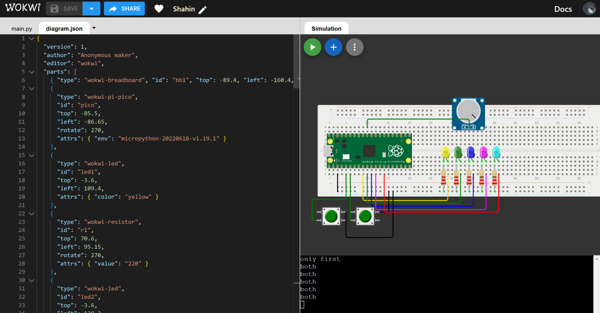

# LED Control Project with Raspberry Pi Pico

This project demonstrates how to control a set of 5 LEDs connected to a Raspberry Pi Pico. The LEDs respond to two buttons, with functionality for toggling ON/OFF states, adjusting brightness with a potentiometer, and a special mode when both buttons are pressed simultaneously.

## Features

- **One Button (`BTN_ON`)**: Toggles LEDs to blink alternately (one on, one off).
- **Second Button (`BTN_OFF`)**: Turns off all LEDs.
- **Both Buttons Together**: Lights up all LEDs at full brightness.
- **Adjustable Brightness**: Use a potentiometer to control LED brightness dynamically.

## Components

- 1x Raspberry Pi Pico
- 5x LEDs (Yellow, Green, Blue, Magenta, Cyan)
- 5x 220Ω resistors
- 1x Potentiometer
- 2x Push Buttons
- Breadboard and jumper wires

## Circuit Diagram

The circuit is designed using Wokwi. Check the `diagram.json` file in the repository for an exact simulation layout.

## How to Use

1. Connect the components as per the `diagram.json` file.
2. Flash the `main.py` code onto your Raspberry Pi Pico using MicroPython or Thonny IDE.
3. Use the buttons to interact with the LEDs:
   - Press the `BTN_ON` button to toggle the blinking state.
   - Press the `BTN_OFF` button to turn off all LEDs.
   - Press both buttons together to turn all LEDs on at full brightness.
4. Adjust the potentiometer to modify the brightness of the LEDs.

## Code Overview

The code uses MicroPython's `machine` module to:
- Control the LEDs with PWM signals.
- Read button states and a potentiometer value.
- Create blinking patterns and brightness adjustments dynamically.

### Key Functions

- **PWM Control**: Adjust the brightness of LEDs using duty cycles.
- **Button Debouncing**: Smooth handling of button states to avoid glitches.
- **Blinking Logic**: Alternate LEDs blinking with a delay.

## Simulation

This project was designed and tested using the [Wokwi Simulator](https://wokwi.com/). The circuit JSON is included in the repository for easy import and simulation.

## License

This project is licensed under the MIT License. See the LICENSE file for details.

Copyright (c) 2025 Max Base
